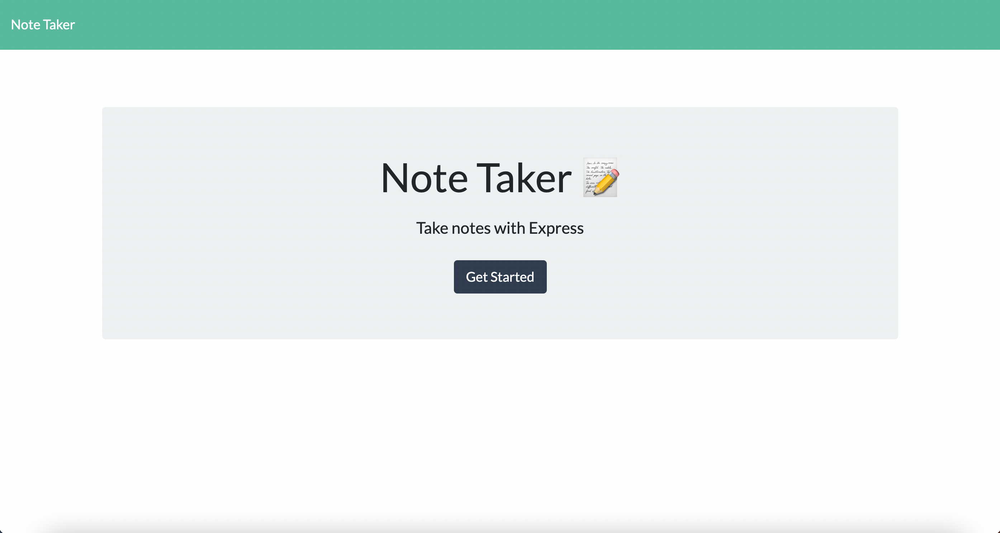
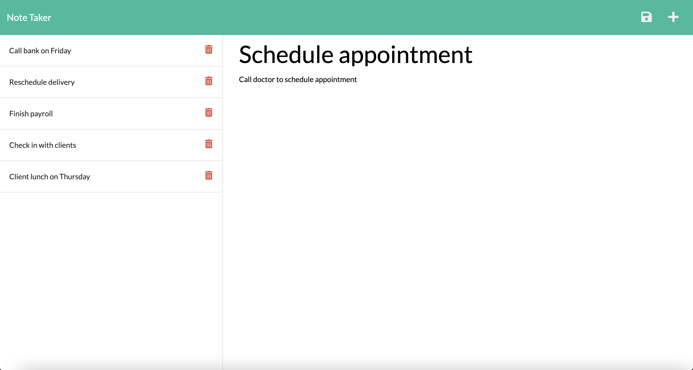

# Note Taker App

## Table of Contents

- [Description](#description)
- [Installation](#installation)
- [Usage](#usage)
- [Contributing](#contributing)
- [Questions](#questions)

## Description

This note taking app lets you write notes with a title and description of note. You are able to save your note with a unique id and be able to come back to it. You can also delete your note.

## Installation

Dependencies include express. It is also required to install the node package npm.

## Usage

## Contributing

Theresa Butterfield

## Questions

For questions, you can reach me at:
GitHub username: Theresa2013
Email: tab61295@gmail.com
